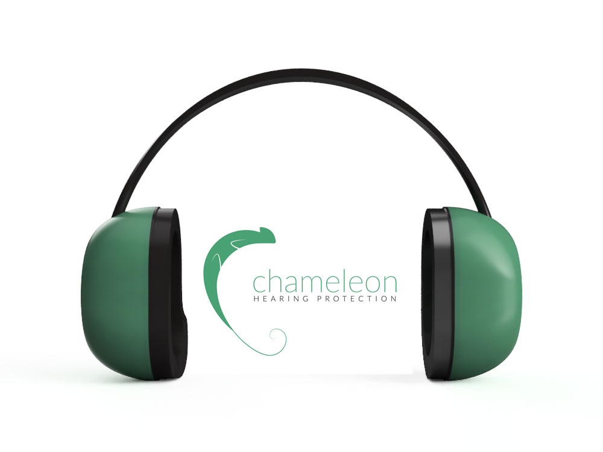

What if your ears could blink? Chameleon is a variable hearing protection device that changes its attenuation according to the environment. It is targeted towards users in periodically loud environments—environments with significant noise exposure, but with periods of quiet—such as construction sites, factories and machine shops. 

I was the product lead in this project, and played a pivotal role in all aspects of product design including defining requirements & benchmarks, designing the attenuation system, measurement circuit, and control logic, and implementing standard test procedures and analyzing the results. 

<figure class='folio_image' id='img1'>
	
<figcaption></figcaption>
</figure>

## User Requirements & Benchmarks

To determine whether we were solving a real problem, we interviewed and surveyed over a dozen potential users working in the targeted environments. Many users admitted openly that they didn't regularly use hearing protection—even when they knew they should—because it was inconvenient and uncomfortable. If they were wearing hearing protection and needed to talk to a coworker, they would need to take the hearing protector off. Because of this tediousness, many people wouldn't put on hearing protection during the loud periods between conversation. Other reasons cited were because of comfort—standard hearing protectors can put a lot of pressure on the head and feel isolating, while earplugs can be hard to insert, especially when wearing work gloves. Findings from these interviews were corroborated by a number of academic sources, which study the comfort, and social implications of hearing protection [^Hsu] [^Park] [^Stephenson&Stephenson] [^Gower] [^Acton] [^Berger].

From all our research we were able to define six major areas that the product should perform in, and user requirements in each. We took these categories and set benchmarks based on government standards, the behaviour of other devices and other research. Durability was also an area of concern throughout the design process, given the use environment, but it was an oversight that we never explicitly defined durability benchmarks.

<table>
<thead><tr><th>Product Attribute</th><th>User Requirement</th><th>Metric</th><th>Unit</th><th>Min</th><th>Target</th><th>Max</th></tr></thead><tbody>
 <tr><td>Attenuation</td><td>Shall protect against excessively loud noise</td><td>Reaction Time</td><td>ms</td><td>0</td><td>100</td><td>1000</td></tr>
 <tr><td>&nbsp;</td><td></td><td>Closed Attenuation</td><td>NRR</td><td>11</td><td>25</td><td>32</td></tr>
 <tr><td>Communication</td><td>Shall allow communication without removal in periods when communication is possible</td><td>Open Attenuation</td><td>NRR</td><td> - </td><td>0</td><td>6</td></tr>
 <tr><td>&nbsp;</td><td></td><td>Threshold to Close</td><td>dB (SPL)</td><td>77</td><td>85</td><td>90</td></tr>
 <tr><td>&nbsp;</td><td>&nbsp;</td><td>Threshold to Open</td><td>dB (SPL)</td><td>50</td><td>55</td><td>65</td></tr>
 <tr><td>Comfort</td><td>Should be comfortable to wear for a full work day</td><td>Weight</td><td>Grams</td><td> - </td><td>245</td><td>330</td></tr>
 <tr><td>&nbsp;</td><td>&nbsp;</td><td>Head Pressure</td><td>Newtons</td><td>0</td><td>10.5</td><td>14</td></tr>
 <tr><td>&nbsp;</td><td>&nbsp;</td><td>Heat</td><td>˚C</td><td> - </td><td>30</td><td>36</td></tr>
 <tr><td>&nbsp;</td><td>Ear should not touch inner cup</td><td>Inner height</td><td>mm</td><td>63</td><td>75</td><td> - </td></tr>
 <tr><td>&nbsp;</td><td>&nbsp;</td><td>Inner width</td><td>mm</td><td>36</td><td>45</td><td> - </td></tr>
 <tr><td>&nbsp;</td><td>&nbsp;</td><td>Depth</td><td>mm</td><td>15</td><td>38</td><td> - </td></tr>
 <tr><td>Cost</td><td>Should be competitively priced relative to similar products</td><td>Cost of Device</td><td>$</td><td> - </td><td>50</td><td>300</td></tr>
 <tr><td>&nbsp;</td><td>Should function for an entire workday</td><td>Operational time</td><td>Hours</td><td>8</td><td>12</td><td> - </td></tr>
 <tr><td>&nbsp;</td><td>&nbsp;</td><td>Power Consumption</td><td>Watts</td><td>0</td><td> - </td><td>1.85</td></tr>
 <tr><td>Measurement Accuracy</td><td>Should accurately measure noise level</td><td>Measurement Error at 4000Hz</td><td>dBSPL</td><td>0</td><td><3</td><td>3</td></tr>
</tbody></table>

More details coming soon!

## Measurement Circuit

## Control Logic

## Mechanical Design

## Comfort and Ergonomics

[^Hsu]: Hsu, Yeh-Liang et al. "Comfort Evaluation Of Hearing Protection", International Journal of Industrial Ergonomics, vol.33, pp. 543-551 (2004)

[^Park]: Park, Min-Yong et. al. "An Empirical Study of Comfort Afforded by Various Hearing Protection Devices: Laboratory versus Field Results", Applied Acoustics, vol. 34, pp. 151-179 (1991)

[^Stephenson&Stephenson]: C. Stephenson and M. Stephenson, "Hearing loss prevention for carpenters: Part 1 - Using health communication and health promotion models to develop training that works", Noise and Health, vol. 13, no. 51, p. 113, 2011.

[^Gower]:  D. Gower and J. Casalvi, "Speech Intelligibility and Protective Effectiveness of Selected Active Noise Reduction and Conventional Communications Headsets", Human Factors: The Journal of the Human Factors and Ergonomics Society, vol. 36, no. 2, 2016.

[^Acton]: Acton, W. J., "Effects of Ear Protection on Communication", The Annals Occupational Hygeine, vol. 10, pp. 423-429 (1967)

[^Berger]: E. H. Berger, "The Effects of Hearing Protectors on Auditory Communications", Aearo Company (1979)