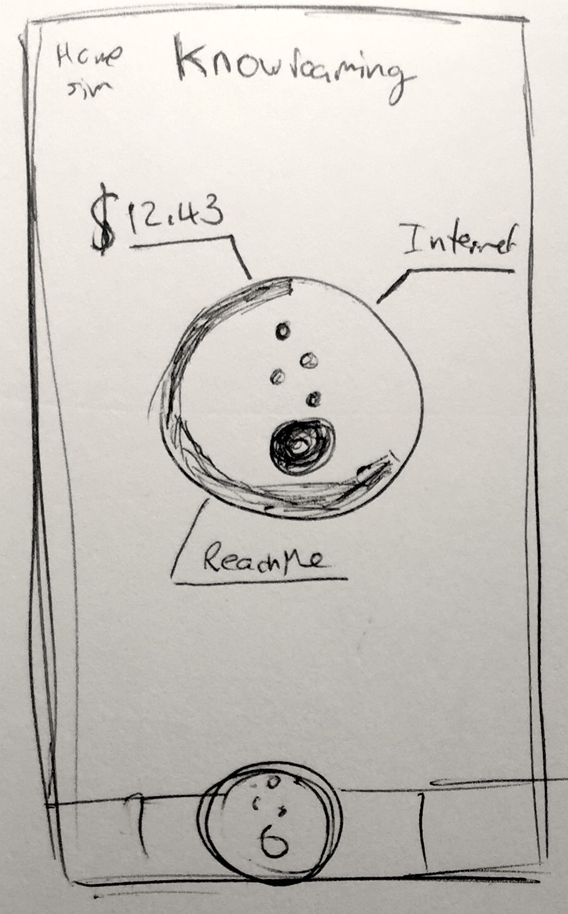
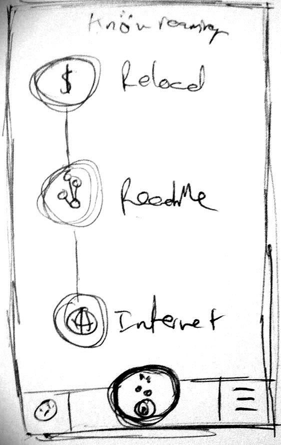
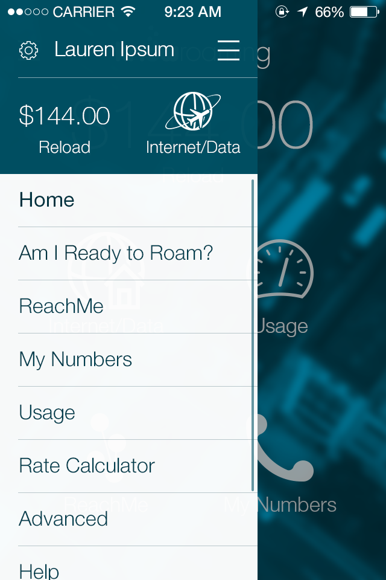
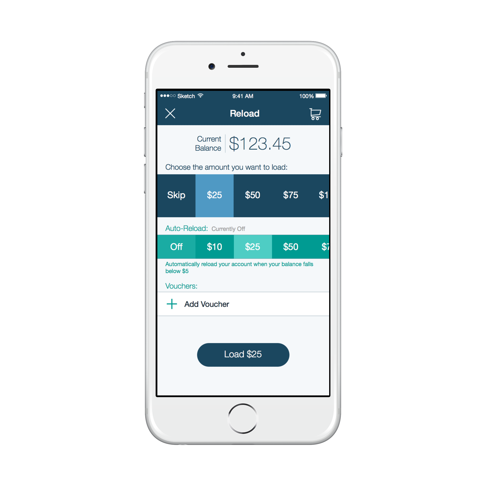
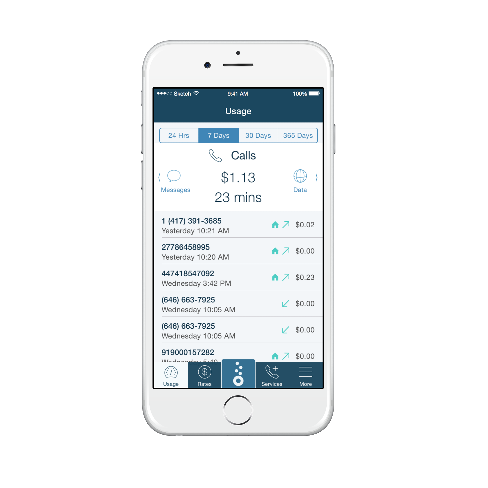
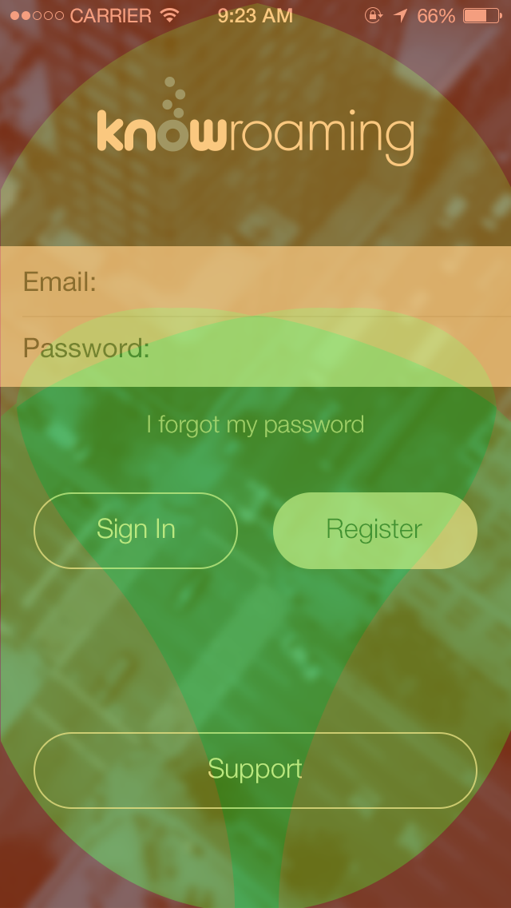
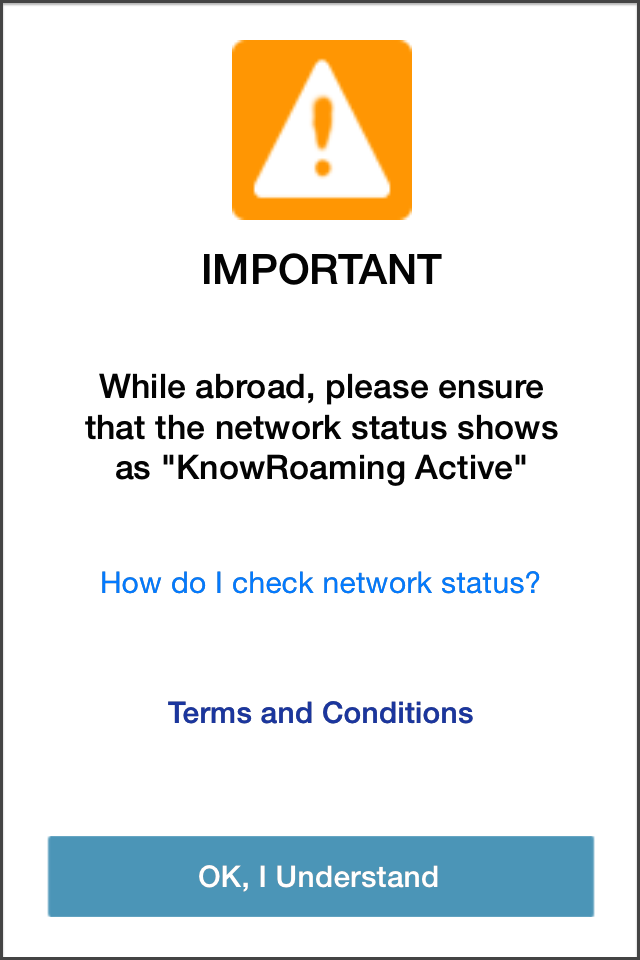
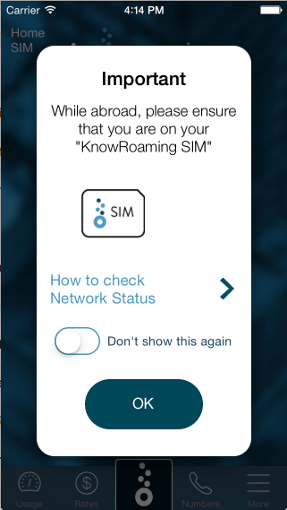
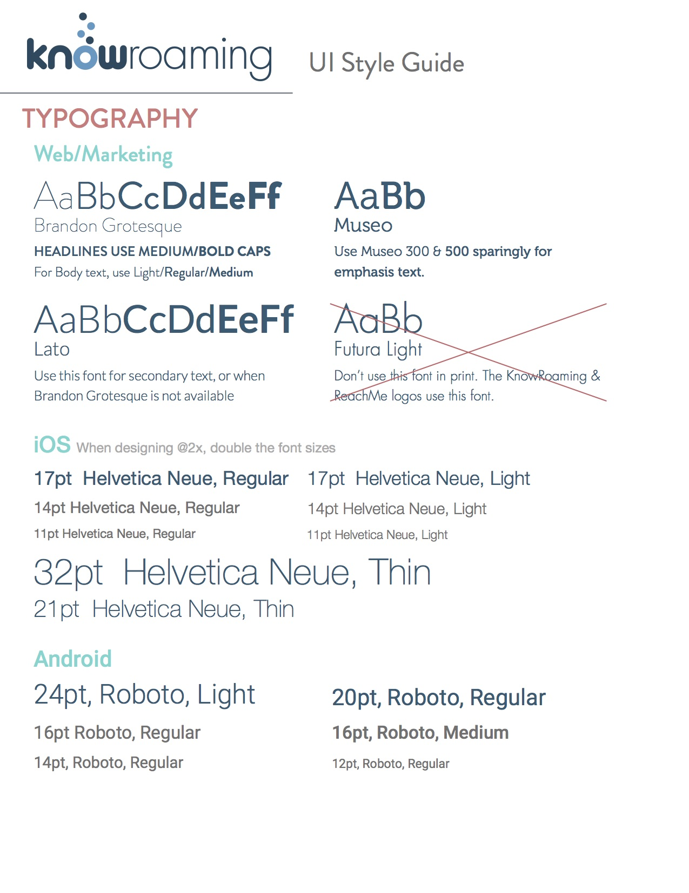
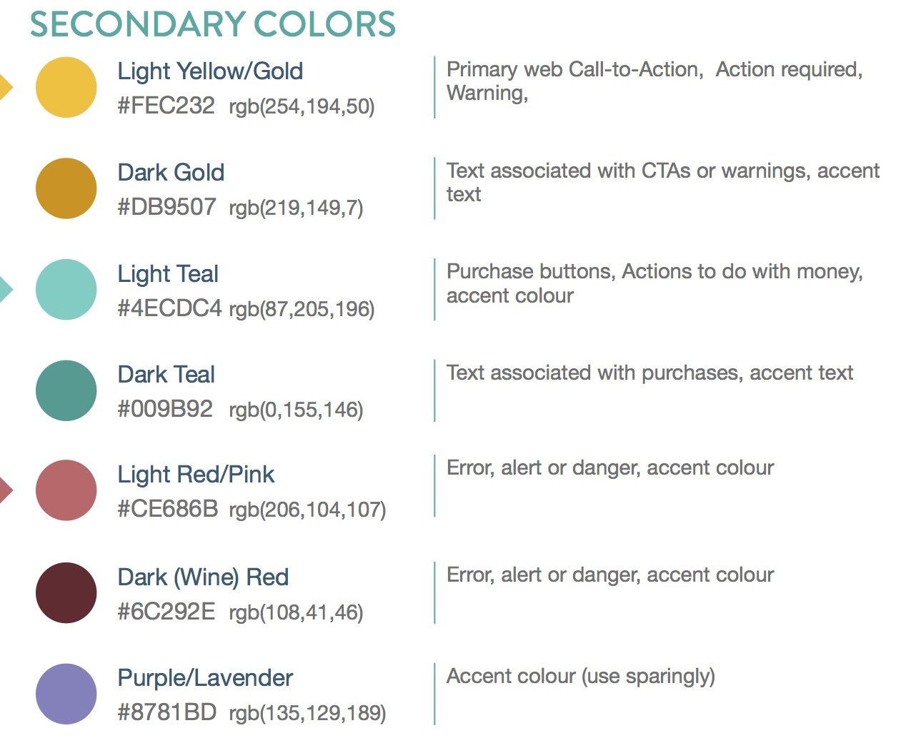

I worked at KnowRoaming as a co-op student from May 2014 to April 2015 (with 4 months of school in between). This was my first ever app design job, and had no supervision from a senior designer; it wasn't until my second term when the company hired a full-time designer. This experience helped me learn and grow a lot as a designer. The following is an attempt to capture my design process at the time.

---

<a href="http://knowroaming.com" target="_blank">KnowRoaming</a> is a Toronto-based company looking to eliminate 'Bill Shock' induced by international roaming—that feeling you get when you realize just how much roaming can cost. Their Smart SIM Sticker, which sandwiches on top of your existing SIM card, acts as a second SIM while you're abroad. You are automatically connected to a local network through the Sticker, and pay only a small fee for roaming. The Smart Sticker comes with iOS and Android companion apps which are account management tools, used to to setup your account, manage your balance and check usage and roaming rates.

<figure class='folio_image' id='img1'>
	
<figcaption></figcaption>
</figure>

I joined the KnowRoaming team in May 2014 as an intern, and as the company’s first User Experience designer. My primary task was to take their existing account management app, and rework it to improve the flow and experience. In coordination with the stakeholders, COO, developers, and customer service, I reworked everything from the registration workflow, to the in app experience at home and abroad using the KnowRoaming SIM Sticker. The design process here was extremely iterative, done over a period of two 4-month work terms, and doesn't quite fit into a nice structured narrative. Nevertheless, here's an account of how the KnowRoaming app was designed.

## Establishing Requirements

To get a sense of what I was dealing with, I took the first few weeks to really get familiar with the current app, and how the system is intended to work. The KnowRoaming service is really quite complex—using the phone's own OS, the SIM card, and cell networks all over the globe to get users connected.

<figure class='folio_image' id='img2'>
	
<figcaption>The pre-2014 KnowRoaming app that was my starting point for analysis and re-design</figcaption>
</figure>

### Heuristic Analysis

Since my job was to redesign the app and not the company's entire business (after all, I _was_ only an intern), I started my journey with a simple heuristic analysis of the app based on [Jakob Nielsen's heuristics](https://www.nngroup.com/articles/ten-usability-heuristics/). While not a true heuristics analysis (it was only me looking at the app), this analysis turned up some interesting insights. Below is a table I compiled of some of the most significant usability "bugs".

<figure id="table1">
<table cellpadding="5px">
	<tr> <th>Usability issue</th>	<th>Severity (1-5)</th>	<th>Usability Heuristic</th>	<th>Recommendations</th> </tr>
	<tr> <td> User is unaware what their KnowSim Serial number is, or where to find it without consulting manual</td>	<td>5</td>	<td>Help & Documentation</td>	<td>Provide easier method of finding Serial, & add documentation in app</td> </tr>
	<tr> <td>User is unsure when they have set-up properly, and are ready to use the app</td>	<td>5</td>	<td>Visibility of System Status</td>	<td>Show salient feedback of the user's set-up status</td> </tr>
	<tr> <td>Leaving the app is required for registration. This forces the user to restart the registration process</td>	<td>5</td>	<td>Flexibility & Efficiency	<td>Return the user to the same location in the app. Make use of OS multitasking </tr>
	<tr> <td>User is unsure whether they have signed up properly due to lack of feedback while processing the registration</td>	<td>4</td>	<td>Visibility of System Status</td>	<td>Provide feedback while communicating with server after sign up</td>
	<tr> <td>Warning about Network Status appears nearly every time user returns to app</td>	<td>4</td>	<td>Control & Freedom</td>	<td>Show System popup only when the user opens the app in a distinctly different geographical region</td>
	<tr> <td>Wizard in app breaks operating system convention</td>	<td>4</td>	<td>Consistency & Standards</td>	<td>Redesign home page to provide necessary salient feedback, and frequently used functions </td>
	<tr> <td>Sign out is unforgiving (no confirmation)</td>	<td>4</td>	<td>Error Prevention</td>	<td>Add alert to confirm sign out</td>
	<tr> <td>User must press an unfamiliar icon to view their account balance</td>	<td>4</td>	<td>Visibility of System Status</td>	<td>Make the account balance more salient.</td>
	<tr> <td>Some screens are cluttered and many elements are not aligned</td>	<td>3</td><td>Aesthetics & Minimalism</td> <td>Re-design most screens, & re-write text</td>
</table>
<figcaption>Some of the most significant findings <form></form> the heuristic analysis</figcaption>
</figure>

The findings weren't all negative though. I made a note of these elements, and they were used as important design criteria for the redesign of the app—the new app shouldn't be worse at something than the old one (unless absolutely necessary). 

Shown in the screenshot above, the app displays the user's current network status front and centre. The visibility of this status is important information when arriving abroad, for quick troubleshooting and for peace of mind.

### User Data

With individual research established, I wanted to get some frontline information from people who are more familiar with the app. I had no way of directly contacting existing users unfortunately, so I had to settle for some second-hand information. Thankfully we had a great support team who were in contact with users daily. I asked them to compile a list of some common issues users were having in the app, whether these were issues they were calling in about, or issues in troubleshooting. This provided me with some good confirmation of the issues I had found in the heuristic evaluation, as well as some new insights that I had not thought of.

### Personas
Along with the list of usability issues, I asked for some basic demographic information of our users. From this information, and some interaction with individuals who generally fit the descriptions, I was able to create three personas of our users. To keep it brief, I've limited the personas to an intent quote here.<!-- , and a short bio. -->

###### Jim
>I’m going on vacation next month, and I'd like to be able to contact my family & friends back home while I'm gone

<!-- *Summary:* Jim is a seventy year-old retired teacher, who spends his time travelling world with his wife. He has three children and several more grandchildren whom he would like to contact while abroad, and wishes to use KnowRoaming in order to do this without spending too much money. Jim needs glasses for reading and occasionally struggles to read smaller type on his mobile device’s screen. -->

###### Paul
>My job is to travel, and I'd like to be able to use my phone during my downtime without paying ridiculous fees.

<!-- *Summary:* Paul is a commercial airline pilot who travels to many countries each week. He enjoys browsing, gaming and streaming media on his smartphone. He wishes to use KnowRoaming as a simple solution to use his smartphone while travelling. -->

###### Tina
>I travel a lot for work, so I need to be able to contact clients, and for them to contact me wherever I am.

<!-- *Summary:* Tina is an independent business consultant who frequently travels abroad to meet with clients. She wishes to use her phone to call out and to receive calls wherever she is in the world. She also wants an interface that is easy to use and that is not too different from what she is used to. -->

### Task Analysis

With the data I now had about the intended and actual use of the app, I was able to do a task breakdown to organize the actions involved in different activities in the app. Primarily targeting first time users, I broke down the tasks involved for a new user to start using the product, since many of these actions also need to be done by existing users before using the product again.

<figure class='folio_image' id='img3'>
	
<figcaption>Registration Task Hierarchy</figcaption>
</figure>

With the amount of unique actions needed to register and get ready to go, there was an opportunity to improve the app greatly.

<!-- ### Storyboards -->

## Design Iteration

Once I had a good picture of the service and its users, I started sketching and making some wireframes for different parts of the app. I was at the company two seperate work-terms, and continued my work on the app where I left off. The design process here was incredibly iterative, and the design of some app sections informed and changed the design of other sections. I've tried to lay out the design process as clearly as possible.

### Account Setup

I started the redesign with the account setup workflow, since it was the first and most frequent task users would do in the app, and could potentially be a major source of friction for customers.

The main principle I used for registration and setup was *good feedback*—a concern we heard frequently was that users were unsure whether they had set up their account properly, and weren't sure whether they were ready to roam.

After looking into all the tasks required to setup an account and discussing with management, we decided that purchasing a foreign number is not necessary on setup, since it's pretty tedious to do on initial setup. 

#### ReachMe

<figure class='folio_image' id='reachme_logo'>

<figcaption></figcaption>
</figure>

A core offering by KnowRoaming is called _Call Forwarding_, a service that allows you to get calls on your home while abroad. To enrol in this service, a user would have to purchase a phone number their home region, and set up forwarding on their home SIM. Since several users were confused at why they would have to purchase a _local_ number for a roaming service, we decided to re-brand the service as ReachMe, which cost a monthly fee and required a single button press to activate in app.

#### Ready to Roam

For a user to know that they're "Ready to Roam", we would need to provide good feedback. Early sketches showed this as a basic checklist, but later involved more elegant representations of these steps. 

<figure class='folio_image' id='ready_to_roam'>

<figcaption>Two early sketches of a "Ready to Roam" feature</figcaption>
</figure>

While this version showed _status_ it wasn't entirely clear that actions should or could be performed. The next iteration showed a flow more clearly.

With account feedback seeming to bleed into design of the home screen, I shifted my efforts there.

### Home Screen and App Architecture

The home screen is the first page a user sees after registering, and every subsequent time they open the app. As such it needs to clearly show all the information a user might need. From the support team's insight into user needs, and the potential for error if an item is not seen, we were able to rank design elements and user actions into a hierarchy.

1. Current Network/SIM card
2. Summary of Status
3. Change APN (Internet connection)
4. Current APN
5. Account Balance
6. Reload account
7. ReachMe
8. Usage, My Numbers, Rate Calculator
9. Account Settings
10. Billing History

I used this hierarchy to inform the home screen design, and the app's information architecture. 

#### Dashboard-Style Design

A Dashboard-style homescreen would allow nearly all navigational components to be easily salient and discoverable. However, with at least 8 different actions with different relative importances, there was a high likelihood that the interface would become cluttered quite quickly, especially if new features would be added. I could make more important elements bigger, and lesser ones smaller, but the risk of clutter remained. 

<figure class='folio_image' id='home-dash'>

<figcaption>The dashboard design. This version didn't make it past a sketch</figcaption>
</figure>

As you might be able to tell, this sketch came before the "Ready to Roam" paradigm was finalized. 

#### Drawer Design

A major benefit of a navigation drawer is that it allows all navigation elements to be viewed simultaneously in a list. The nav drawer also provides a greater area of screen space to be used to display more important information. 

I put a drawer in into the dashboard design using the main screen for the high-importance elements placing the items of lower importance in the less-salient Drawer. This iteration of the top-level navigation pattern was used while designing other elements of the interface.

<figure class='folio_image' id='home-drawer'>

<figcaption></figcaption>
</figure>

I did have qualms about the drawer though, for [discoverability reasons](https://uxdesign.cc/death-by-hamburger-2d1db115352a#.865mhybml).

#### Tab Bar

A tab bar is ubiquitous on both iOS and Android. With the ablility to show highly important information and actions with a default tab, place others in the tab bar, and even more still in a now-common "More" tab, the tab bar seemed like the best route to go.

While there are still some elements hidden, the more frequently used items are in the bar. This design avoids clutter that the dashboard had, and does not have the discoverability issue of the drawer (thanks to the word "More" under the hamburger icon).

<!-- TODO Mention the bubbles fill up -->

<figure class='folio_image' id='home-drawer'>

<figcaption></figcaption>
</figure>

Using [Prototype on Paper](https://marvelapp.com/pop/) (now owned by Marvel), I made prototypes of these navigation patterns and tested on co-workers, friends and family. In retrospect I should've tested more rigorously, but time constraints (and inexperience at the time) were a major limiting factor at the time.

### Use Cases

There are a number of cases in which the app can be used, and the app should behave differently in each scenario. I worked with the product team to flesh out what these use cases were, and what actions needed to be performed when.

<!-- #### At Home -->

<figure class='folio_image' id='home_bar'>
	
<figcaption></figcaption>
</figure>
The first use case is *At Home*. This is (ideally) where a user will do most of their account setup and management. Things like setting up a call forwarding number are not technically possible while abroad, so this action should be encouraged while on the Home SIM.

<!-- #### Abroad -->
<figure class='folio_image' id='abroad_bar'>
	
<figcaption></figcaption>
</figure>
When a user arrives abroad, neither Android nor iOS will fully setup a data connection, so the first thing a user must do when arriving abroad is set up this connection. Once the data connection has been established, users can use their device just like at home. 

<!-- #### Back Home -->
<figure class='folio_image' id='backhome_bar'>
	
<figcaption></figcaption>
</figure>
You might think this seems like the same as the first use case—and you wouldn't be entirely wrong. It is very similar, only with one major distinction. While the geographical case is the same, iOS users arriving back home after being abroad will still have the KnowRoaming data connection. In order to return to their home data plan, users need to redo the same process they took to establish their roaming data connection.

From a UX standpoint this one was tricky, since this really shouldn't be necessary, but was due to technical limitations. It was difficult to counvince users that once arriving back home, their data connection wouldn't automatically reconnect like the regular cell service would.

_**Home SIM while Abroad / Abroad on Home SIM**_

In some rare cases, either (a) the KnowRoaming SIM will fail to connect/re-connect, or (b) a more advanced user will force a SIM switch. In these cases the actions available to users are different from the standard cases, so I'd have to take these cases into account.

### Designing for Use Cases

With these use cases defined, it became clear that the previous home screen design wouldn't quite cut it. A user on the home screen at Home (yeah, this terminology got confusing, but "home screen" was only an internal term and user wouldn't see it, so we kept it) might see two of the three bubbles filled, and be lead to believe they weren't ready to roam, when in fact they had done all they could for the time being. 

The solution was relatively simple—remove all options in the checklist that are not possible in the user's current state.

<figure class='folio_image' id='phases'>

<figcaption></figcaption>
</figure>

<!-- Add more here -->

<!-- ### ReachMe Screen -->

<!-- ## ReachME Screen -->

<!-- ## Tutorial -->

## UI Refinement

Once the major UX flow was mostly decided, I took to designing and refining different UI elements.

### Controls and Layout

<!-- Binary (buttons), discrete (incrementer/stepper/spinner/radio), multistate (checkbox), continuous (slider) -->

#### Reload Screen

When redesigning the account top-up/reload screen, I pressed for user editable amounts to allow for the ablility to top up with a precise the amount that the user wanted. This was vetoed for logistical and support reasons, and so I had to design for a number of discrete reload options, as well as the same number of Auto-Reload options. I quickly realized that if I put all the options on the screen at once, the screen would get really crowded, and likely overflow off the bottom of the screen. Trying o find ways to efficiently layout this information, I took inspiration from the Starbucks app at the time, which had a horizontally scrolling row to select how much you wanted to put on your Starbucks card. The idea would be to have enough horizontal room for 4.5 cells, which would cut off one cell and imply scrollability.

I brought this idea to our lead iOS developer, and we brainstormed ideas on how to implement something like this. She came up with a rotated custom list UI element which worked perfectly. I was happy with the result, and we implemented this for both the Reload and Auto-Reload amounts. 

<figure class='folio_image' id='reload'>

<figcaption>Screenshot of the Reload screen</figcaption>
</figure>

#### Usage Screen

Another tricky screen to design the layour for was the usage screen. I tried to come up with some creative ways of showing a user how many minutes, messages and megabytes they had used in the past day, week, month or year. I had several pages of mockups showing different charts and graphs, but I couldn't get all the information and options laid out nicely on the screen. We finally decided to keep it simple, and go with a basic list of all the events within the given time period.

Even when keeping the data simple, allowing selection from both four different time ranges and three different types of usage was a challenge. The instinct would be to use two layers of segmented controls, but after mocking that up and making some prototypes, these designs didn't seem right. The segmented control pattern is rarely doubled up in practice, and generally works as a secondary tab bar. A backup pattern would be needed for one of either the time range or usage type.

<figure class='folio_image' id='usage'>

<figcaption>Screenshot of the Usage History screen</figcaption>
</figure>

To solve this problem, I still went with a similar pattern, but with a different type of interaction, in hopes that it would be less confusing to users than a double segmented control. (In retrospect, maybe a double segmented control wouldn't be that bad... We should test it). The 

#### Design for the "Thumb Zone"

There have been many blog posts about designing for the [thumb zone](http://www.uxmatters.com/mt/archives/2013/02/how-do-users-really-hold-mobile-devices.php), or sometimes the "stretch zone" as it's sometimes called. There are three rough regions on a mobile device: easy-, ok- and hard-to-reach with the thmb for a single handed user. When I was laying out components in the UI, I kept the thumb zone in mind, and kept priority interacion zones within the easy- or ok-to-reach zones. The hard-to-reach areas should be reserved for feedback-only or infrequent interactions.

<figure class='folio_image' id='thumbzone'>

<figcaption>Illustration of the Thumb Zone over the registration screen of the app</figcaption>
</figure>

#### Reminders and Pop-ups

Everyone hates pop-ups, but sometimes the're necessary. However, previous versons of the KnowRoaming app overused pop-ups, showing one essentially everytime a user returned to the app outside of about a one hour window. There were some pop-ups that were necessary though. Certain pop-ups contained highly important contextual information when a user arrives abroad or changes networks reminding them what actions to take. I took to redesigning this reminder to first make it fit btter visually, and second make it convey the information (hopefully) more clearly. This reminder will appear only once every few times the user ooens the app (I don't recall the exact interval), as well as when a cell network change is detected. Users also have the ability to disable the notification. 

<figure class='folio_image' id='reminders'>

<figcaption></figcaption>
</figure>

### Typography

Early in the design process, I tried using some fonts from KnowRoaming's logotype and marketing materials, specifically [Brandon Grotesque](https://typekit.com/fonts/brandon-grotesque) and [Futura](https://typekit.com/fonts/futura-pt)—two approachable sans-serif fonts. These mockups never seemed to look right since these fonts were designed for print, and weren't always readable on the phone screen. After exploring some other fonts, I decided that the simplest decision would be to use the system fonts: Helvetica Neue for iOS (at the time), and Roboto for Android. After experimenting with several fonts while designng both the app and other graphics, I was able to create a [style guide](../KnowRoaming_Style_Guide_2015.pdf) which includes colour, typography, logo use, and other elements. Also included in the style guide guidelines for colours and font weights to use on different background colours.

<figure class='folio_image' id='style-typography'>

<figcaption>The typography page of the 2015 KnowRoaming Style Guide</figcaption>
</figure>

### Colour

Also included in this style guide, is a colour guideline. When KnowRoaming had hired a full-time graphic designer, the two of us worked together to standardze the colours we used, and for what functions in the UI. Since the company logo had already been designed, it was only natural to use the included light and dark blues as the primary colours in the app. Additional blues were selected as button-press states, for dark text, and a light blue as an off-white background. 

<figure class='folio_image' id='style-blue'>

<figcaption>Blues used in the app</figcaption>
</figure>

We also outlined secondary colours: Gold, Teal, Red and Lavender. These colours all had specific functions and meanings in the app.

<figure class='folio_image' id='style-secondary'>

<figcaption>Secondary colours and their uses in the app and web UI</figcaption>
</figure>

### Icons

#### ReachMe Logo

Since I was one of the original ideators of the ReachMe service branding, I created a logo for the unique service. The design was fairly straightforward, and to be honset, derivative. The icon uses the bubbles featured in the company logo, connected with lines to signify connectedness. The logotype simply echoes the company logo font weights.

<figure class='folio_image' id='reachme_logo'>

<figcaption></figcaption>
</figure>

#### KnowRoaming Icon Set

<figure class='folio_image' id='icon-set'>

<figcaption>A limited selection of KnowRoaming icons</figcaption>
</figure>

On the home screen, icons representing the user's current state, the actons they can perform in that state, and tab bar icons were all necessary. To create these icons, I first took inspiration from existing iconsets on sites like [Iconfinder](http://www.iconfinder.com). Based on some common symbols, I created an icon set in a unified KnowRoaming style—a thin stroke with rounded end-caps, in keeping with the iOS design language at the time.

The "Setup Data" icons were interresting to design, since they were fairly unique compared to the other icons. I started with a (hopefully) ubiquitous symbol for "internet"—the globe—and added elements to symbolize the state of being abroad or returning home. After some iterating on these elements, I arrived at the following icons.

<figure class='folio_image' id='data-icons'>

<figcaption>KnowRoaming icons for Abroad Data, and Home Data </figcaption>
</figure>

## Conclusion (tl;dr)

To close this massively long article, I'll say that this was an amazing experience, and I learned a lot independently about design; the process and the craft. If I could go back and do this again, I would definitely invest more in true user testing. We didn't have many resources, so most of the testing was done on co-workers, friends and family—a process I like to call "guerilla user-testing". Actually reaching out and talking to users (something that terrified me then, and still does a little), as well as investing in user-testing software (like usertesting.com) would likely have sped up the design process. Creating some designs and getting feedback within a few days could have given me real answers as opposed to educated hunches which were never really proven.
 
<!-- ### Motion Design

There wasn't much time to include motion design in the app design since my bandwidth, as well as that of the developers, was quite limited. There are some instances in the app that make good use of some motion design.

 Usage screen

 ReachMe screen

 Intro Tutorial

 More Tab -->

<!-- Mention button sizes and control layout -->

<!-- Note: no multigesture interactions -->

<!--
 Design Patterns

 	 -->

<!-- To start, I analyzed the existing app and noted what it does well, and where it fell short. Over the next few months I worked out sketches and wireframes, iterating  and discussing the designs every week. Once a basic workflow was decided, I began to work on the new visual style, and finally came up with a viable product near the end of my term there.

When I returned the following January, the product had been out for several several months, and user feedback was plentiful. I used this feedback, received from customer service, to improve on the design from the previous term. One of the most noteworthy improvements is the use of Phases - different use cases in the app corresponding to the user’s current situation - At Home, Abroad, and Back Home. I modified the existing home screen to display situational buttons that appear when needed, and disappear when not needed. For example, a user can’t setup their Roaming Data connection when they’re at home.

Among the other improvements were the Reload, ReachMe and Checkout workflow, the number purchasing workflow, and the appearance of the bottom tab bar -->
 <!--
			$img2 = $img_path."knowroaming_app_abroad.jpg";
			$img2_caption =  "The Current 2015 version of the KnowRoaming App";
			$img3 = $img_path."knowroaming_app_process.jpg";
			$img3_caption =  "An later sketch of the new app";
			$img4 = $img_path."knowroaming_app_reload-reachme.jpg";
			$img4_caption =  "The new Reload and ReachMe subscription page";
			$img5 = $img_path."knowroaming_app_login.jpg";
			$img5_caption =  "The new login screen, featuring double parallax (on supported devices)"; -->

<!-- To be Continued... -->
