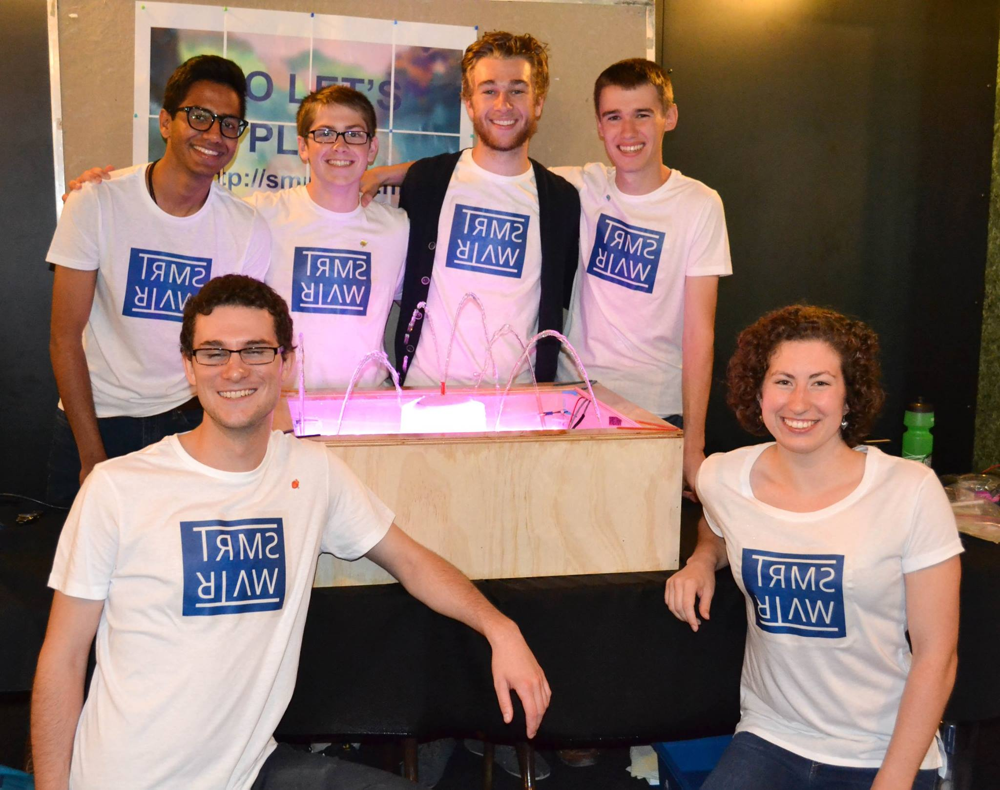

For our Systems Design Engineering 3A design project, our design group, consisting of [Josh Bradshaw](http://joshbradshaw.ca), Emma Cooper, Isaac Hunter, Matt Jones, and Shubh Jagani, designed and built an interactive water fountain. Users interact with the fountain by playing an online game called QuizDrop. In QuizDrop, 1-4 players compete against one another. Each player is assigned a particular corner of the fountain, and as they score points the jet in their corner moves the height of the water spray increases. At the end of the three question game, the player with the most points wins full control of the fountain. They can choose between several different preprogrammed routines, and they can switch between them at will for 30 seconds.

My main roles were designing the gameplay, app interaction, and how the fountain would react to certain interactions. I built most of the front end web app, and part of the Python server (on <a target="_blank" href="https://github.com/Adam93MT/SMRTWATR/tree/master/smrtwatr_server">GitHub</a>). I also designed the fountain’s wood and plastic basin, and worked on the mechanism involved in rotating each of the four corner fountain spouts.

<figure class='folio_image' id='img2'>
	
<figcaption></figcaption>
</figure>

We unveiled our fully functional prototype at our class’s public design symposium in July 2015. Our fountain was the crowd favorite, and during the three hour event we were able to demonstrate and play around 70 games. Below are videos of the fountain during the end-game while some of our classmates were playing a round.

<figure class="folio_image">
	<iframe width="560" height="315" src="https://www.youtube.com/embed/sUKH4mjTl4k" frameborder="0" allowfullscreen></iframe>
</figure>
<figure class="folio_image">
	<iframe width="560" height="315" src="https://www.youtube.com/embed/GdZsdQxUZdo" frameborder="0" allowfullscreen></iframe>
</figure>