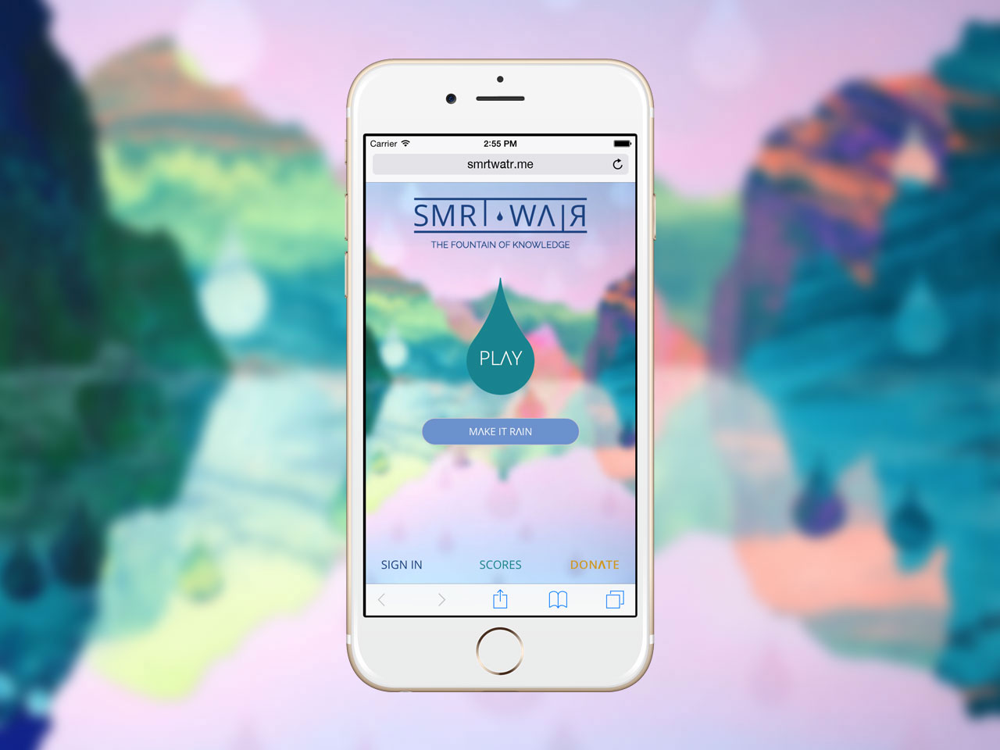
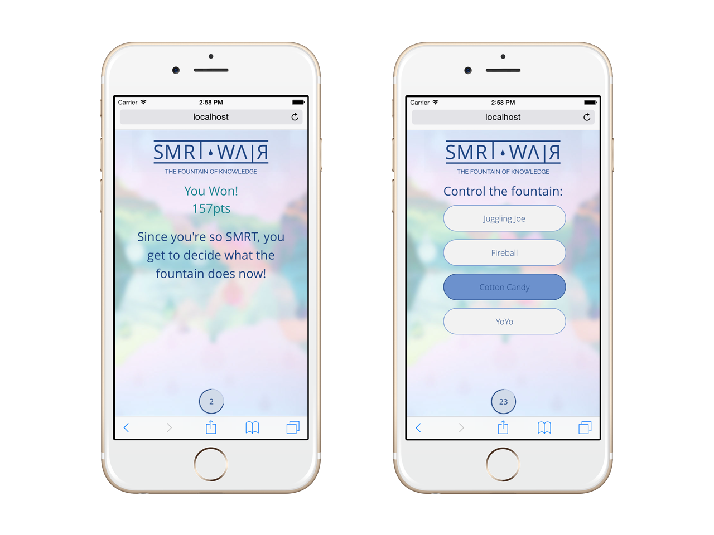

SMRT WATR (pronounced "smart water") is an interactive fountain and mobile game IoT experiece. For our 3rd year engineering project, [Josh Bradshaw](http://joshbradshaw.ca), [Isaac Hunter](https://isaachunter.ca), [Shubh Jagani](http://www.shubhjagani.com), [Matt Jones](https://www.linkedin.com/in/matt--jones/), [Emma Cooper](https://www.linkedin.com/in/emmacooper2562/), and I designed and built a dynamic fountain which changes based on the results of a web-based quiz game. Users could sign in to the web app at smrtwatr.me, and join a quiz match with three other people. As a player answered a question correctly, their corner of the fountain would get higher in response. The player with the highest score after all questions could control the fountain for 30 seconds, selecting from a list of pre-set routines. 

My main contribuitions to this project were UX and front-end development, as well as some backend development and mechanical design.

<figure class='folio_image' id='smrtwatr-ui'>
	
<figcaption></figcaption>
</figure>

For our design class we were required to design something to do with *water*, using the Internet of Things. Out of several different options, we were inspired by several public fountains and noticed that many of these were rarely appreciated as more than just decoration. People were more involved in their smartphones than interacting with either the fountain, or with others. We wanted to change that. 

## User Experience

The user experience for this project involves both a digital product (the web-app), and a physical product (the fountain), and how the two interact together. From the beginning we wanted actions performed on the phone to affect the fountain in the real world. We entertained a number of different interaction options, including *make-it-rain*, inspired by throwing real coins into a fountain where users could donate to throw virual currency into the fountain, or to gain control of the fountain for a length of time, and a crowed-sourced performance, where users could select an action which would be placed in a performance queue.

After considering which ideas would create the highest levels and engagement, we decided to design a quiz game where the winner would be given control of the fountain's behaviour for a limited amount of time. (A quiz also had the beneft allow us to keep our given name "Smart Water").

After some brainstorming and discussion, I was able to flesh out the task flow in of the entire fountain/game experience in the flow-chart below [^flowchart].

### User Interface

With a workflow established, I got to UI design. The priority screens were a homescreen, lobby, in-game UI and the endgame routine. Using Sketch, I mocked up these screens, and tested on my groupmates and other classmates. Using their feedback, I improved and refined my designs. 

<figure class='folio_image' id='smrtwatr-lobby&ingame'>
	
<figcaption>Screenshots of the Lobby & In-game UI</figcaption>
</figure>

<figure class='folio_image' id='smrtwatr-endgame'>
	
<figcaption>Screenshots of the Endgame UI</figcaption>
</figure>

## Implementation

We set up a [Tornado Web](http://www.tornadoweb.org/en/stable/) Python server on a Raspberry Pi to serve the web UI, and to communicate with the fountain's controller. Tornado supports html templates, and can dynamiclly change the UI on the fly. This was unlike any web development I had ever done, but I got used to it pretty quickly, and wrote all of the app's HTML and SASS, as well as some server-side logic. All front-end, back-end, and controller code is available on [GitHub](https://github.com/Adam93MT/SMRTWATR).
<!-- 
## The Fountain

I wasn't heavily involved in the design of most mechanical systems  -->

[^flowchart]: SMRT WATR UX Flowchart
<figure class='folio_image' id='smrtwatr-ux-flow'>
	
<figcaption></figcaption>
</figure>