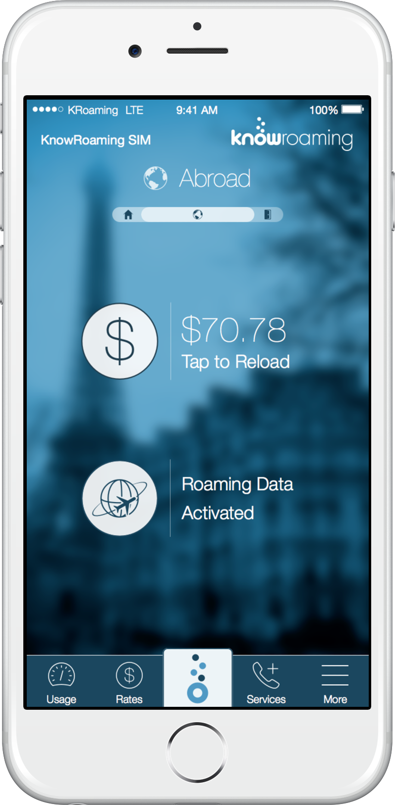
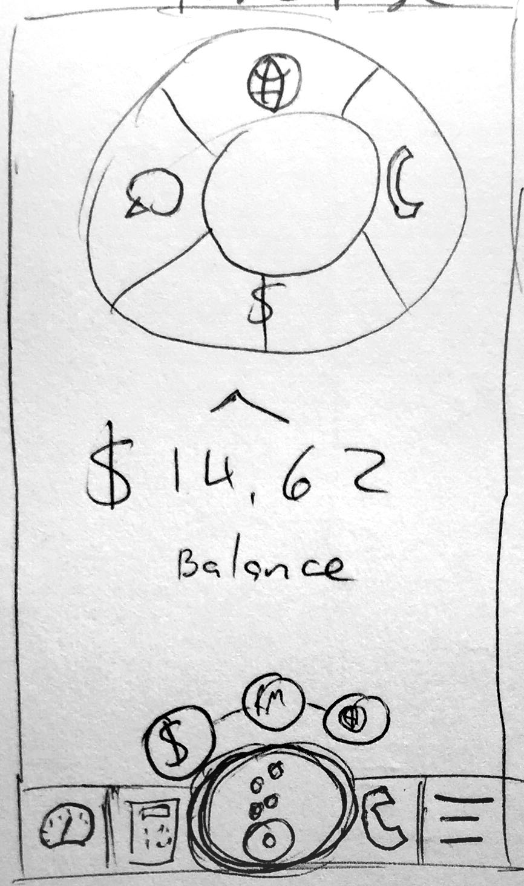
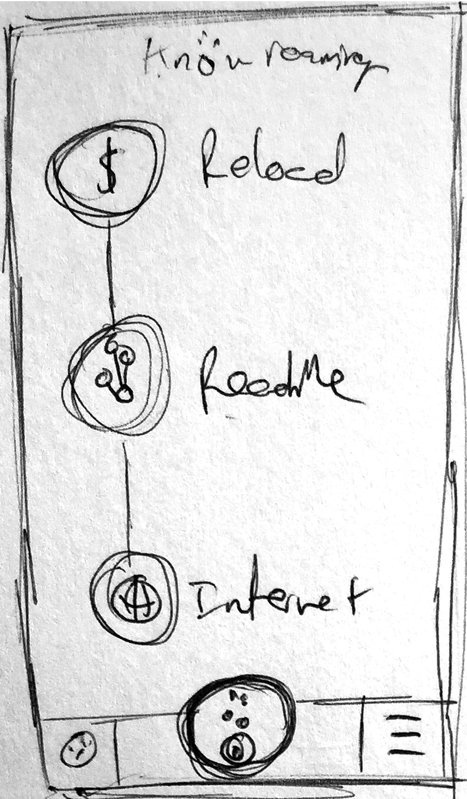
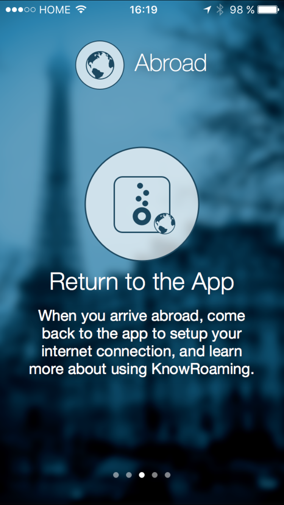

# KnowRoaming

## An interface that shows the important information, no matter where you are.

#### People were never quite sure if things were set up properly before traveling abroad. This made them uneasy and unsure whether to trust the product. 

#### I overhauled the layout, architecture and visual style of the app to make it simpler, and more informative. The options available on the home screen change to match the actions you can take at each phase of your trip.

## Background

KnowRoaming is a small company based in Toronto that makes a smart SIM sticker—a layer on your SIM card that connects you while abroad. To manage the prepaid account, among other things, KnowRoaming has an iOS and Android app.

As features were added to the app over time it became cluttered, with no coherent structure or visual design. There were frequent complaints that the app was difficult to navigate, and customers were never sure that the sticker, account and the rest of the KnowRoaming system were setup properly.

Not trusting the product was a big issue, and needed to be addressed. It was my responsibility to overhaul the app structure and UI to make it more cohesive and understandable.

## Navigation

There are a lot of functions in KnowRoaming that needed to make it into the app, from rate calculator, to phone number management. We needed a way to efficiently layout these functions for users in as flat an architecture as possible.

This super-flat architecture assumes equal importance to all of these functions—but all features aren't created equal. The team and I looked at these elements, and determined which were core to the use of our service, and which were secondary. 

Since we couldn't easily fit all the options on the home screen, we tested a drawer-style navigation that let the important functions be visible in a dashboard-style home screen, with secondary functions in the drawer.

This prototype tested well in-house, but the "hamburger menu" wasn't always found right away. Given that one primary persona was non digital-natives, an [undiscoverable drawer](https://uxdesign.cc/death-by-hamburger-2d1db115352a#.865mhybml) would not be the best navigation option. 

I went back to a tab bar as in the original app, but took inspiration from Yelp and others, adding a unique, more salient central tab, and a _more_ drawer tab. 

<!-- <figure class='folio_image' id='tab-bars'>
	
	
<figcaption>Pressing "Am I Ready to Roam?" would guide the user through a travel checklist.</figcaption>
</figure> -->

In addition to the rest of what I mention in this article, I also re-designed each screen linked on the tab bar and home screen.

## Ready to Roam
We also noticed the "Ready to Roam" functionality was too hidden, and would need to be a more prominent feature on the home screen. 

<!-- <figure class='folio_image multi-image' id='ready-to-roam'>
	
	
	
<figcaption>Three styles of homescreen checklist designs.</figcaption>
</figure> -->

I made some sketches of different ways to make "Ready to Roam" status more prominent. After some testing and better mocks, we saw that the vertical-bubbles were the best and clearest choice.
Users could quickly be sure they were "Ready to Roam" when the bubbles on the home screen filled in.

<!-- <figure class='folio_image' id='home-bubbles'>
	
<figcaption>Ready to Roam Checklist on the home-screen</figcaption>
</figure> -->

We shipped this version of the homescreen and saw good feedback on the new UI style. But there were bubbles on the home screen that were never filled at home—users can't setup their roaming internet connection until they arrive abroad. This resulted in continued calls into customer support about user trust confidence. 

## Three Phases

I took inspiration from how the product was being marketed, and decided to try and split the app into the three use conditions: 1) At Home, 2) Abroad, 3) Arriving Home.

<!-- <figure class='folio_image multi-image' id='phases-home'>

<figcaption>Three Phases of the KnowRoaming home screen</figcaption>
</figure> -->

By splitting the home screen into three phases with different UI in each, we were able to ensure users were confident they were doing the right thing, and could use their phone without worry.

## Tutorials

KnowRoaming is a complex system. Involving multiple cell networks, a SIM Sticker, a mobile app and the OS itself, there is a lot to teach and coach people on.

After registration, users are presented with a short tutorial, explaining the three phases, and how to know they are "Ready to Roam". We also designed coach marks that play whenever a user changes phases.

<!-- <figure class='folio_image multi-image' id='tutorial'>
	
	
	
<figcaption>The tutorial that plays once a user finishes registration</figcaption>
</figure> -->

---
## Man of many hats

I could go on about all the things I did as KnowRoaming's premiere designer—like designing all screens and flows in the app, creating a [style guide](?p=kr_branding), re-branding the [ReachMe](?p=kr_reachme) service, designing [marketing materials](?p=kr_marketing), building an [athlete sponsorship mini-site](?p=kr_athletes), animating an [intro video](?p=kr_video) for the app, designing more efficient [packaging](?p=kr_packaging) and even designing a [retail stand](?p=kr_retail) to display the SIM stickers in stores.

